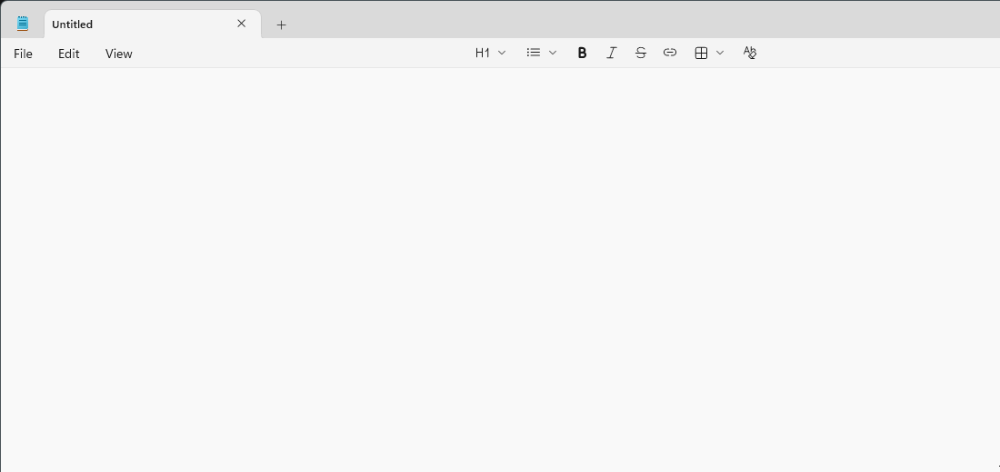

# GIF Capture

Record part of your screen as a high-quality GIF, straight to the clipboard. Windows only.



*The whole flow: Win+Shift+D, drag a region, record, trim, copy, paste into Obsidian. The GIF that lands in Obsidian was made by GIF Capture; the outer recording was made with ffmpeg, since GIF Capture can't film its own overlays.*

1. Press **Win+Shift+D** and drag over the area you want.
2. Recording starts when you let go. Press **Win+Shift+D** again or click **Stop** (30 s max).
3. Scrub and trim in the editor, then press **Enter**.
4. Paste anywhere: Slack, Teams, Discord, email, docs. The GIF is also saved to `Pictures\GifCapture`.

It lives in the system tray: left-click the icon to capture, right-click for the GIF folder or Quit.

## Install

Download `GifCapture-Setup.exe` from [Releases](../../releases) and run it. No admin rights needed; ffmpeg is included.
If Windows shows "Windows protected your PC", click **More info → Run anyway** (the installer isn't code-signed).

## Editor keys

| Key | Action |
| --- | --- |
| Space | Play / pause |
| ← / → | Step one frame (Shift: 1 second) |
| I / O | Set start / end at the playhead |
| R | Reset trim |
| Enter | Copy GIF |
| Esc | Discard |

## Run from source

Requires Python 3.9+ and ffmpeg on `PATH` (`winget install Gyan.FFmpeg`).

```
pythonw gifcapture.pyw
```

Settings (hotkey, frame rate, max length, max width) are constants at the top of `gifcapture.pyw`.

## Build the installer

Requires Inno Setup 6 (`winget install JRSoftware.InnoSetup --scope user`). Produces `dist\GifCapture-Setup.exe`:

```
powershell -ExecutionPolicy Bypass -File build.ps1 -Version 1.0.1
```

## How it works

- Capture: ffmpeg `gdigrab`, lossless RGB at 30 fps.
- GIF: 15 fps, `palettegen` + `paletteuse` (sierra2_4a dithering, rectangle diff mode), lanczos downscale above 1280 px.
- Clipboard: the GIF is placed as a file (`CF_HDROP`) plus raw `GIF` bytes, which is what keeps it animated when pasted.

The installer bundles FFmpeg, which is licensed under the GPL (see `FFMPEG-LICENSE.txt` in the install folder).
